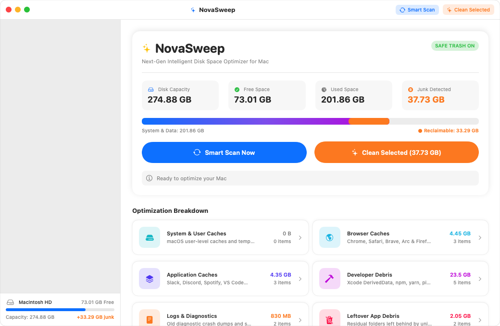
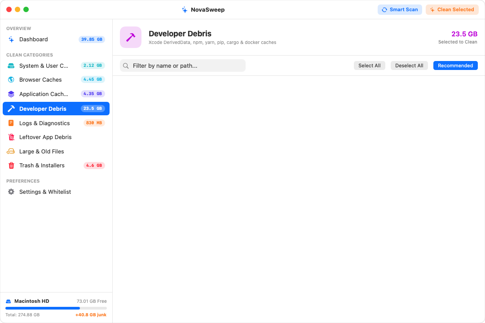
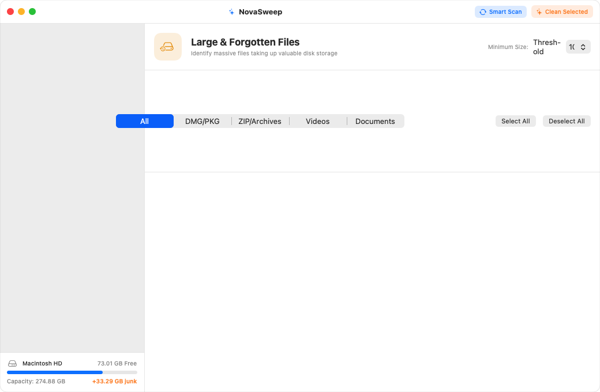
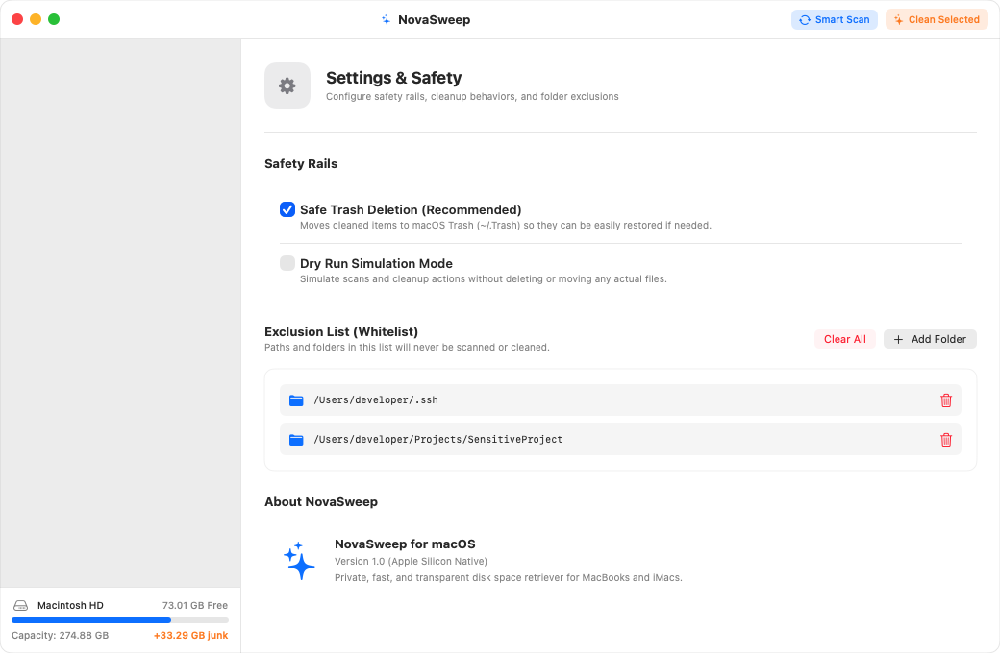

# ✨ NovaSweep for Mac

> **Next-Gen Intelligent Disk Space Optimizer & Cache Reclaimer for macOS**  
> *Native • Safe • Private • Lightning Fast*

---

## 🚀 Overview

**NovaSweep** is a high-performance native macOS desktop application designed to retrieve wasted hard disk storage occupied by accumulated caches, leftover application debris, developer build artifacts, massive forgotten files, and non-productive system logs over time.

Unlike traditional third-party cleaners that require subscriptions or run background telemetry daemons, **NovaSweep is 100% native, private, and transparent**, built with Swift and SwiftUI specifically for Apple Silicon MacBooks and desktop Macs.

---

## 📸 Screenshots & Interface Showcase

<p align="center">
  
  <br>
  <em>NovaSweep running natively on macOS: real-time disk metrics, storage breakdown gauge, and 1-click optimization</em>
</p>

| 🔨 Developer Debris Sweeper | 📦 Large & Old Files Explorer | 🛡️ Settings & Safety Rails |
| :---: | :---: | :---: |
| [](docs/screenshots/developer_debris.png) | [](docs/screenshots/large_files.png) | [](docs/screenshots/settings.png) |
| *Xcode, npm, pip, cargo & gradle* | *Custom size thresholds & Finder reveal* | *Safe Trash-first, dry run & disclaimer* |

---

## 🌟 Unique App Name: **NovaSweep**

* **Nova**: Evoking cosmic energy and stellar brilliance—transforming cluttered, bogged-down storage into fresh, expansive space.
* **Sweep**: Precise, intelligent, and safe reclamation of disk real estate.

---

## 🛠️ Feature Modules & Capabilities

### 1. ⚡ Dashboard & Smart Scan
* **Live Storage Gauge**: High-contrast storage breakdown showing Total Capacity, Used Space, Free Space, and Detected Junk.
* **1-Click Smart Scan**: Multi-threaded asynchronous scanning engine audits your entire disk in seconds without freezing the UI.
* **1-Click Clean**: Reclaims recommended junk safely with instantaneous visual feedback.
* **Visual Breakdown Cards**: Clickable overview cards for each optimization category with live size counters.

### 2. 🗄️ Deep Cache Cleaner
* **User-Level Caches**: Scans `~/Library/Caches` for stale application cache files.
* **Browser Caches**:
  * Google Chrome
  * Apple Safari
  * Brave Browser
  * Mozilla Firefox
  * Microsoft Edge
  * Arc Browser
* **App & Electron Bloat**:
  * Slack, Discord, Spotify, VS Code, Cursor, Zoom, Microsoft Teams, Notion, and Telegram.

### 3. 🔨 Developer Debris (The Dev Supercharger)
* **Xcode**:
  * `DerivedData` (reclaims tens of gigabytes of intermediate build artifacts)
  * `Archives` and legacy `iOS DeviceSupport` symbols
* **Package Manager Caches**:
  * **Node.js**: NPM (`~/.npm/_cacache`), Yarn (`~/.yarn/cache`, `~/Library/Caches/Yarn`), pnpm (`~/Library/pnpm/store`)
  * **Python**: Pip cache (`~/.cache/pip`, `~/Library/Caches/pip`)
  * **Rust**: Cargo crates cache (`~/.cargo/registry/cache`)
  * **Java / Android**: Gradle caches (`~/.gradle/caches`)
  * **iOS / macOS**: CocoaPods repository cache (`~/Library/Caches/CocoaPods`)
  * **Homebrew**: Downloaded bottle caches (`~/Library/Caches/Homebrew`)

### 4. 📄 Logs & Diagnostics
* Application logs (`~/Library/Logs`)
* Diagnostic crash reports & hang dumps (`~/Library/Logs/DiagnosticReports`)
* CrashReporter storage
* Mail downloaded attachments (`~/Library/Containers/com.apple.mail`)

### 5. 👻 Leftover / Orphaned Application Hunter
* Scans `~/Library/Application Support` and compares against all installed apps in `/Applications` and `~/Applications`.
* Flags orphaned support folders left behind by uninstalled applications that users dragged to Trash months ago.
* **Safety First**: Orphaned items require manual review and are not auto-deleted.

### 6. 📦 Large & Old Files Explorer
* Configurable threshold: Flag files exceeding **50 MB**, **100 MB**, **250 MB**, **500 MB**, or **1 GB**.
* Filter chips: Filter by file type (DMG/PKG installers, ZIP/Archives, Videos, Documents).
* Displays file path, modified date, and formatted size.
* **Reveal in Finder** button to inspect before deleting.

### 7. 🗑️ Trash & Download Installers
* macOS Trash bin item count and size.
* Old `.dmg`, `.pkg`, and `.iso` installation images in `~/Downloads` that have been sitting unused for over 14 days.

### 8. 🛡️ Enterprise-Grade Safety Rails
* **Safe Trash Mode (Enabled by Default)**: Items are moved to the macOS Trash (`~/.Trash`) rather than permanently deleted with `rm -rf`, so any file can be restored with a single click.
* **Dry Run Mode**: Run full scans and cleanup simulations without modifying or moving a single byte on disk.
* **Folder Whitelist / Exclusions**: Add sensitive folders or project directories to the exclusion list via a native `NSOpenPanel` folder picker.
* **System Path Protection**: Hardcoded guardrails prevent accidental touches to root `/`, `/System`, `/Library`, `/Applications`, or home directory roots.

---

## 🖥️ User Interface Highlights

* **macOS Tahoe / Sequoia / Sonoma Native Styling**: Native `NavigationSplitView` with vibrant sidebar.
* **Retina Squircle App Icon**: Designed with custom cosmic sweep motifs matching Apple's Human Interface Guidelines.
* **Keyboard Shortcuts**:
  * `⌘R`: Run Smart Scan
  * `⌘K`: Clean Selected Items
* **Search & Filter**: Real-time fuzzy filtering of scanned items by filename, subcategory, or path.
* **Context Menus**: Right-click any file to "Reveal in Finder", "Open", or "Add to Whitelist".

---

## 📂 Project Structure

```
NovaSweep/
├── src/
│   ├── NovaSweepApp.swift          # Main @main SwiftUI application entry point
│   ├── Models/
│   │   └── Models.swift            # CleanCategory, DiskItem, StorageSnapshot, CleanSummary
│   ├── Engine/
│   │   ├── ScannerEngine.swift     # Multi-threaded concurrent disk scanner
│   │   ├── CleanerEngine.swift     # Safe trash-first cleaning engine
│   │   └── AppState.swift          # State ViewModel & async coordinator
│   └── Views/
│       ├── SidebarView.swift       # Sidebar navigation & mini disk gauge
│       ├── DashboardView.swift     # Hero storage overview & 1-click optimization
│       ├── CategoryDetailView.swift# Granular file lists with search & toggles
│       ├── LargeFilesView.swift    # Large files explorer with size threshold picker
│       ├── SettingsView.swift      # Safety rails & whitelist exclusion manager
│       └── CleanCompleteModal.swift# Cleanup celebration & report modal
├── Resources/
│   ├── Info.plist                  # macOS Application bundle metadata
│   ├── AppIcon.icns                # Multi-resolution Retina macOS application icon
│   └── generate_icon.swift         # Script to generate Retina squircle icon set
├── build.sh                        # One-click build, bundle & install script
└── README.md                       # Documentation
```

---

## 🚀 How to Launch & Use

The application is compiled and installed directly to your Applications folder:

```bash
open ~/Applications/NovaSweep.app
```

Or rebuild anytime from source:
```bash
cd ~/Projects/NovaSweep
./build.sh
```

---

## ⚠️ Disclaimer

NovaSweep is an open-source utility designed to help users identify and retrieve disk space occupied by transient caches, build artifacts, system logs, and unused files.

* **Review Before Deletion**: While NovaSweep incorporates robust safety rails (`SystemGuard`, TCC privacy compliance, subpath-aware whitelisting, and a default Safe Trash mode), deleting files is an important operation. Please review selected items before executing a clean.
* **Dry Run Mode**: If you are uncertain about what will be cleaned, enable **Dry Run Simulation Mode** in Settings or from the Scan menu to simulate the cleanup without modifying any files.
* **Backups Recommended**: It is always recommended practice to maintain regular system backups using Apple Time Machine or an external drive.
* **No Warranty**: This software is provided "as is", without warranty of any kind, express or implied. In no event shall the authors or copyright holders be liable for any claim, damages, or other liability arising from the use of this software.

---

## 📄 License

This project is licensed under the MIT License - see the [LICENSE](LICENSE) file for details.

